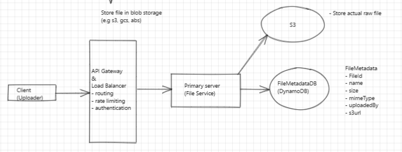
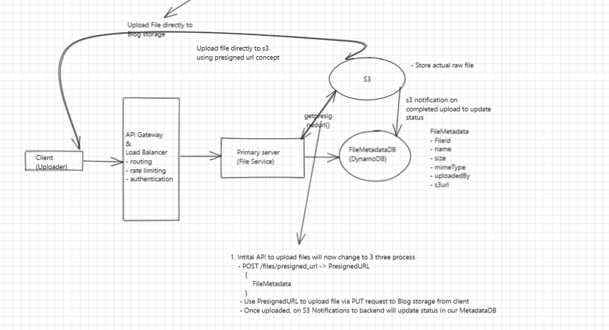

# Google Drive / Dropbox Design

## 1. Requirements

### 1.1 Functional
- Users can upload files  
- Users can download files  
- Users can share files  
- Users can sync files across devices  

### 1.2 Non-Functional
- Availability prioritized over consistency  
- Support for large files (e.g., 100GB)  
- Secure and reliable system  
- Minimal latency  

---

## 2. Core Entities
- **File**  
- **FileMetadata**  
- **User**  

---

## 3. API

### 3.1 Upload File
```
POST /files
{
    "file": "<file_data>",
    "fileMetadata": {
        "name": "example.txt",
        "size": 1024,
        "type": "text/plain"
    }
}
```

### 3.2 Download File
```
GET /files/{file_id}

Response:
{
    "file": "<file_data>",
    "fileMetadata": {
        "name": "example.txt",
        "size": 1024,
        "type": "text/plain"
    }
}
```

### 3.3 Share File
```
POST /files/{file_id}/share
{
    "users": ["user1@example.com", "user2@example.com"]
}
```

### 3.4 Get File Changes to Sync
```
GET /files/{file_id}/changes

Response:
{
    "fileMetadata": [
        {
            "version": 2,
            "timestamp": "2024-01-01T12:00:00Z",
            "modifiedBy": "user@example.com"
        }
    ]
}
```

## 4. High level design
### 4.1 📁 File Uploading: Where to store file bytes and metadata

#### 1️⃣ Where Should File Metadata Be Stored?

### Metadata Includes:
```
fileId
userId
fileName
fileSize
contentType
storagePath
version
permissions
checksum
createdAt
```

### Why NoSQL Works Well Here (Your Thinking is Correct ✅)

- **Flexible schema** (versions, sharing, permissions)
- **High read/write throughput**
- **Easy horizontal scaling**
- **Metadata ≠ transactional money data**

### Common Choices:

- DynamoDB
- MongoDB
- Cassandra

### 📌 Conclusion (Metadata):

**File metadata → NoSQL database**

---

# File Storage Architecture Guide

## 1️⃣ Where Should Raw File Bytes Be Stored?

### ❌ NOT on Your Primary Application Server

Storing files directly on the API / primary server causes:

- **Disk limits** (100GB files 🚫)
- **Server crashes affect file availability**
- **Difficult horizontal scaling**
- **High latency under load**

> 👉 **Primary servers should never store raw file bytes**

### ✅ Use Blob / Object Storage

Raw file bytes should be stored in distributed object storage systems like:

- Amazon S3
- Google Cloud Storage
- Azure Blob Storage

#### Why Object Storage?

- Designed for huge files (TB scale)
- Automatically replicated (high availability)
- Cheap compared to DB or local disk
- Supports resumable & multipart uploads

### 📌 Conclusion (Raw Bytes):

**File bytes → Object / Blob Storage**

---

## 2️⃣ How Do Users Upload Files to Blob Storage?

### ❌ User → App Server → Blob Storage (Bad Approach)

**Reasons:**

- App server becomes bottleneck
- Huge bandwidth cost
- Server memory pressure
- Poor latency



### ✅ User → Blob Storage Directly (Best Practice)

This is done using a **pre-signed URL**.

#### Flow (Simplified):

1. **User asks backend:** "I want to upload a file"
2. **Backend:**
   - Authenticates user
   - Creates metadata record (empty / pending)
   - Generates pre-signed upload URL
3. **User uploads file directly to blob storage**
4. **Blob storage confirms upload**

---


## 4.2 📥 File Download Flow
### Core Question
#### Should users download files via:
 - Primary application server
 - Blob/Object storage
 - CDN in front of blob storage

## Option 1️⃣ User → Primary Server → File
``` 
User → API Server → File Storage → API Server → User
```
#### ✅ Pros
- Easy to implement
- Centralized access control

#### ❌ Cons
- Server bandwidth bottleneck
- Poor scalability for large files (GBs)
- High latency
- Expensive infra
- Server failure affects downloads

#### 📌 Verdict:  ❌ Never used in real cloud-scale file systems

## Option 2️⃣ User → Blob Storage
```
User → API (auth + metadata)
     → receives pre-signed download URL
User → Blob Storage (download)

```

#### ✅ Pros
- High throughput
- Supports huge files (100GB+)
- No load on API servers
- Secure via time-limited URLs

#### ❌ Cons
- Latency depends on user’s distance from storage region
- Repeated downloads hit storage repeatedly

#### 📌 Verdict:✅ Good, but can be improved

## Option 3️⃣ User → CDN → Blob Storage
```
User → API (auth)
     → gets signed CDN URL
User → CDN (cache hit)
        ↓ cache miss
      Blob Storage

```
#### ✅ Pros
- Lowest latency (edge locations)
- Massive scalability
- Reduced blob storage cost
- High availability
- Ideal for shared files

#### ❌ Cons
- Slightly complex setup
- Cache invalidation complexity (versioning needed)
#### 📌 Verdict: ✅ Industry standard


---

### 4.3 🔗 File Sharing Flow

#### 🗂️ Where should file sharing information live?
- Store sharing info only in metadata DB
- Store sharing info in cache
- Create a separate shares table / collection

#### Option 1️⃣ Store sharing info inside file metadata (Embedded)
```
{
  "fileId": "f1",
  "ownerId": "u1",
  "sharedWith": [
    { "userId": "u2", "permission": "view" },
    { "userId": "u3", "permission": "edit" }
  ]
}

```
##### ✅ Pros
- Simple
- Single read for file + permissions
- Works for small sharing lists

##### ❌ Cons (BIG ones)
- Document size grows unbounded
- One file shared with 10k users → hot document
- High write contention
- Hard to query:

##### 📌 Verdict: ❌ Not suitable at scale

#### Option 2️⃣ Store sharing info only in cache (Redis)

##### ✅ Pros
- Extremely fast permission checks
- Low latency

##### ❌ Cons (Critical)
- Cache is not source of truth
- Data loss on eviction / restart
- Hard to ensure consistency
- Revocation becomes risky
##### 📌 Verdict: ❌ Never store sharing info only in cache

#### Option 3️⃣ Separate Shares / Permissions Table
```
{
  "fileId": "f1",
  "sharedWithUserId": "u2",
  "permission": "view",
  "sharedBy": "u1",
  "expiresAt": null
}

```

##### ✅ Pros

- Scales to millions of shares

- Efficient queries:

- Files shared with user X

- All users having access to file Y

- Easy revocation

- No hot metadata document

- Clean separation of concerns

##### ❌ Cons

- Requires join / multiple reads

- Slightly more complex

##### 📌 Verdict: ✅ Industry-standard design
